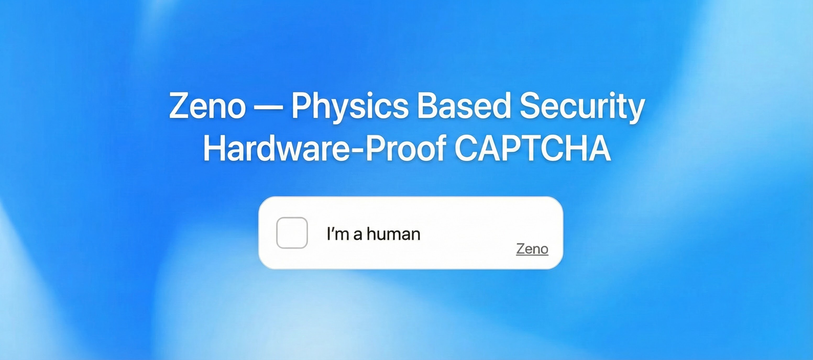

# Zeno

**Zeno** is a high-security, privacy-preserving, proof-of-work CAPTCHA system designed for the modern web.  
It runs on the edge using Cloudflare Workers and WebAssembly (Rust), ensuring low latency and high scalability.



## Features

- **Physics-Based Security**: Uses **Memory (Cuckatoo Cycle)** and **Time (VDF)** to physically constrain attackers.
- **ASIC/GPU Resistant**: Default configuration (`GB=18`) requires **~32MB RAM per instance**.  
Attackers need 32GB RAM for 1,000 parallel threads.
- **Configurable Defense**: Adjust `graph_bits` (10-20) and `vdf` (10-1M) to balance security vs UX.
- **Privacy-First**: No cookies, no tracking, no third-party scripts.
- **Edge Deployment**: Runs entirely on Cloudflare Workers (Serverless).
- **WebAssembly**: Core logic powered by Rust-based WASM for performance/security.
- **Modes**:
  - **Standard**: In-page widget.
  - **Floating**: Corner popup.
  - **Invisible**: Background verification for seamless UX.
- **Universal Compatibility**:
  - **Pure JS Fallback**: Automatically activates on devices without WebAssembly support. Full feature parity including progress reporting.
  - **Force Mode**: Option to strictly enforce JS or WASM for testing.
- **Internationalization (i18n)**: Fully customizable strings and styling via CSS variables.

## Demo

Try the live demo: **[https://zeno.js.org/demo/](https://zeno.js.org/demo/)**

## Quick Start (Client)

```html
<script type="module" src="https://cdn.jsdelivr.net/gh/zeno-security/zeno/dist/client/zeno.min.js"></script>
<zeno-widget zeno-site-key="YOUR_SITE_KEY" zeno-api-endpoint="/api"></zeno-widget>
```

Listen for the completion event:

```javascript
document.querySelector('zeno-widget').addEventListener('solve', (e) => {
  console.log('Token:', e.detail.token);
});
```

## Default Configuration

| Parameter | Default | Effect |
| :--- | :--- | :--- |
| `graph_bits` | **18** | ~32 MB RAM required |
| `vdf` | **450** | ~2.5s sequential delay |
| **Total** | — | **~3s solve time** |

## Protection Targets

| Threat | Recommended Config | Time | Memory |
| :--- | :--- | :--- | :--- |
| Script Bots | GB=13, VDF=100 | ~0.9s | 2 MB |
| Bot Farms | GB=15, VDF=150 | ~1.3s | 5 MB |
| GPU Attacks | GB=17, VDF=100 | ~0.5s | 16 MB |
| **ASIC/GPU (Default)** | **GB=18, VDF=450** | **~3s** | **32 MB** |
| High-Value Actions | GB=18, VDF=300 | ~2.7s | 32 MB |
| Maximum Security | GB=19, VDF=200 | ~2.6s | 62 MB |

## Server Installation

### Option A: Cloudflare Dashboard (GUI)

1.  **Fork the Repository**: Fork [zeno-security/zeno](https://github.com/zeno-security/zeno) to your GitHub account.
2.  **Log in to Cloudflare**: Go to the [Cloudflare Dashboard](https://dash.cloudflare.com) > **Workers & Pages**.
3.  **Create Application**:
    * Click **Create Application**.
    * Connect your GitHub account.
    * Select your forked `zeno` repository.
4.  **Configure Build**:
    * **Framework Preset**: None / Custom.
    * **Build Command**: `npm run build`
    * **Build Output Directory**: `dist`
5.  **Environment Variables & R2**:
    * Once created, go to **Settings** > **R2 Object Storage**.
    * Create and bind three buckets: `zeno-challenges`, `zeno-tokens`, `zeno-bans-day` to the variable names `zeno_challenges`, `zeno_tokens`, `zeno_bans_day`.

### Option B: Wrangler CLI

```bash
# Clone the repository
git clone https://github.com/zeno-security/zeno.git
cd zeno

# Install Dependencies
npm install

# Create R2 Buckets
npx wrangler r2 bucket create zeno-challenges
npx wrangler r2 bucket create zeno-tokens
npx wrangler r2 bucket create zeno-bans-day

# Deploy
npx wrangler deploy
```

## Architecture

Zeno consists of three main components:

1.  **Core (Rust/WASM)**: Handles Cuckatoo Graph generation and Class Group VDF computation.
2.  **Solver (WASM + JS)**: Dual-mode solver ensures 100% device compatibility (WASM primary, Pure JS fallback).
3.  **Server (Cloudflare Worker)**: Issues challenges, verifies proofs, and manages storage via R2.
4.  **Client (TypeScript)**: A lightweight Web Component (`<zeno-widget>`) that orchestrates the solving process in a web worker.

## Development

### Benchmarks

Run the benchmark yourself: **[docs/benchmark/benchmark.html](https://zeno.js.org/benchmark/benchmark.html)**

### Full Build

```bash
npm run build
```

## License

 Required Notice: © Copyright 2025 KSEC - Erez Kalman (`kaerez[at]gmail[dot]com` | `www.kalman.co.il` | `https://github.com/zeno-security/zeno` | `https://github.com/kaerez`)
 This software is licensed under the PolyForm Strict License 1.0.0.
 You may obtain a copy of the License at: https://polyformproject.org/licenses/strict/1.0.0/

 SPDX-License-Identifier: PolyForm-Strict-1.0.0